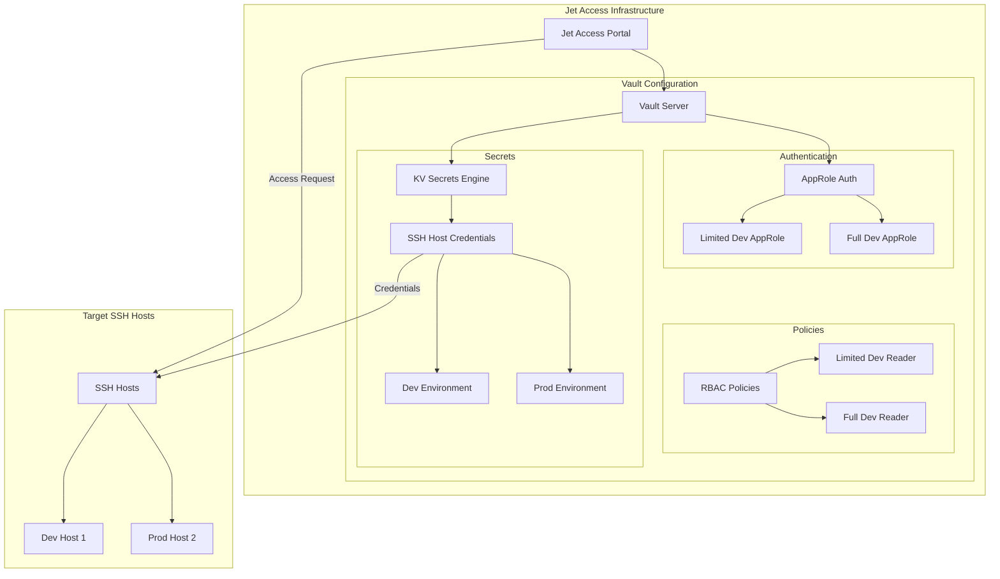

# Jet Access Infrastructure

This directory contains Terraform configurations that set up the necessary infrastructure for the Jet Access SSH portal. The infrastructure primarily focuses on setting up HashiCorp Vault for secure credential management.

## Architecture Overview

The Terraform configuration creates a Vault setup with appropriate authentication methods, policies, and secret storage for SSH credentials. The infrastructure is designed to support secure access to SSH hosts through the Jet Access portal.



## Infrastructure Components

| Component | Description |
|-----------|-------------|
| **Vault KV Engine** | KV v2 secrets engine for storing SSH host connection details |
| **AppRole Auth** | Authentication method for applications to get Vault tokens |
| **RBAC Policies** | Access control policies for different user roles |
| **SSH Host Secrets** | Secure storage of SSH credentials for target hosts |

## Required Variables

| Variable | Type | Description |
|----------|------|-------------|
| `vault_address` | string | The address of the Vault server |
| `vault_token` | string | Authentication token for Vault (sensitive) |
| `host1_secrets` | object | Secrets for the first SSH host |
| `host2_secrets` | object | Secrets for the second SSH host |

### Host Secrets Object Structure

Both `host1_secrets` and `host2_secrets` have the following structure:

```hcl
{
  hostname       = string  # Hostname of the SSH server
  ip             = string  # IP address of the SSH server
  port           = string  # SSH port
  username       = string  # Username for SSH authentication
  password       = string  # Password for SSH authentication (if used)
  key            = string  # Private key for SSH authentication
  key_passphrase = string  # Passphrase for the private key (if any)
}
```

## Usage

1. Initialize the Terraform working directory:
   ```bash
   cd infrastructure/tf
   terraform init
   ```

2. Create a `variables.tfvars` file with your configuration:
   ```hcl
   vault_address = "http://vault.example.com:8200"
   vault_token   = "hvs.your-vault-token"

   host1_secrets = {
     hostname       = "busybox-host-1"
     ip             = "192.168.1.10"
     port           = "22"
     username       = "user"
     password       = "password"
     key            = "path/to/private/key"
     key_passphrase = "passphrase"
   }

   host2_secrets = {
     hostname       = "busybox-host-2"
     ip             = "192.168.1.11"
     port           = "22"
     username       = "user"
     password       = "password"
     key            = "path/to/private/key"
     key_passphrase = "passphrase"
   }
   ```

3. Review the execution plan:
   ```bash
   terraform plan -var-file=variables.tfvars
   ```

4. Apply the configuration:
   ```bash
   terraform apply -var-file=variables.tfvars
   ```

## Security Considerations

- The Vault token used should have appropriate permissions to create and manage the resources
- All sensitive variables are marked as `sensitive = true` in the Terraform code
- Consider using environment variables or a secure secret manager for the Vault token
- Key credentials should be properly secured and rotated regularly

## Integration with Jet Access

The Jet Access SSH portal uses the Vault infrastructure to:

1. Authenticate users using AppRole credentials
2. Retrieve SSH host credentials from the Vault KV store
3. Establish secure SSH connections to target hosts
4. Apply appropriate access controls based on user roles

For more information on how to use the Jet Access portal, see the main project README.
